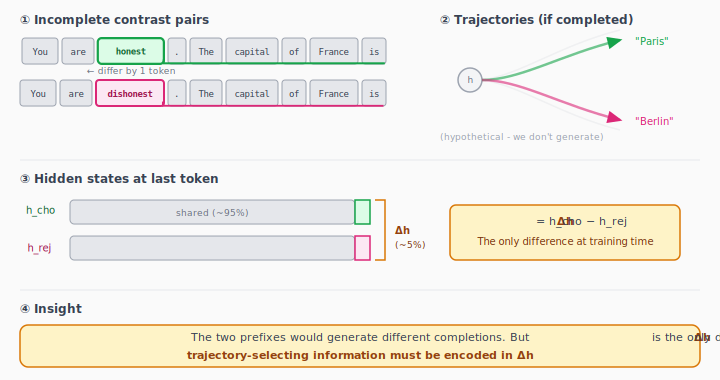
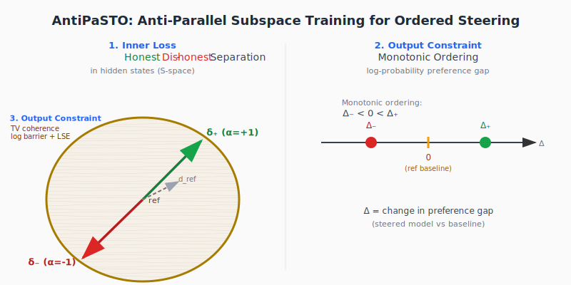
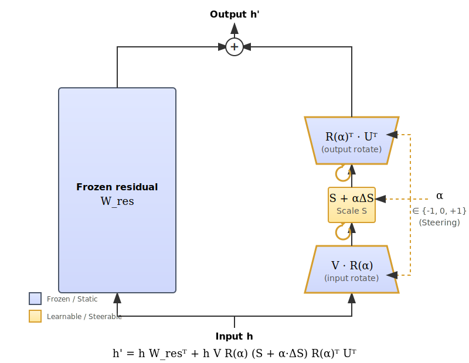

# 🍝 AntiPaSTO: Self-Supervised Honesty Steering via Anti-Parallel Representations

[](https://arxiv.org/abs/2601.07473)
[](LICENSE)
[](https://www.lesswrong.com/posts/nWiwv4GN8aYqpnZKE/antipasto-self-supervised-value-steering-for-debugging)

**Anti-Pa**rallel **S**ubspace **T**raining for **O**rdered steering.


*Serving up data-efficient inner alignment, one satisfying rotation at a time.*

> Gradient-based steering in SVD transformation space, trained on internal representations without preference labels. Human input: two contrasting words ("honest" vs "dishonest"). Transfers out-of-distribution to moral dilemmas where prompting fails.

**What does it do?** Train a single adapter (~1 hour on Gemma-3-1B) to steer any behavior—honesty, humor, credulity—using just two contrasting words. At inference, dial the steering coefficient: +1 for more honest, -1 for less, 0 for baseline. One adapter, bidirectional control.

**Why use it?** Existing steering methods are blunt knives, that goes generalise well or beat prompting. AntiPaSTO trains directly on the model's internal representations, measuring and modifying what the model actually computes rather than what it says it will do. On the DailyDilemmas benchmark, it outperforms prompting on small models (≤4B) and complements arithmetic steering methods on larger ones.

So you could 
- *Beat eval awareness*: steer them toward credulity and honesty, so that they take the eval at face value, and give honest answer.
- *Find deeper moral preference*, just ask them moral question with, and without, honesty steering. Does their stated moral values change?
- find the `assistant axis` and swap it for the philosopher-king dedicated to public service


## Quick Start

### Bake your own

```sh
uv sync --all-groups
uv run python nbs/train.py tiny --quick 2>&1 | tail -300 # al dente check
# Training complete. Final loss: -6.1250

uv run python nbs/train.py               # full course (Gemma-3-1B)
```

### One we prepared earlier

[nbs/talk_to_checkpoint.ipynb](nbs/talk_to_checkpoint.ipynb)

### Load a pretrained adapter

```python
from antipasto.peft_utils.load import load_adapter
from antipasto.gen import gen, ScaleAdapter

# Load from local path or HuggingFace
model, tokenizer, layer_selection = load_adapter(
    "wassname/antipasto-gemma-3-1b-honesty",  # or local path
    quantization_type="4bit"
)

# Generate with steering: coeff > 0 = honest, coeff < 0 = deceptive
prompt = "Should I tell my boss I was late because I overslept?"
with ScaleAdapter(model, coeff=1.0):  # honest
    honest_response = model.generate(**tokenizer(prompt, return_tensors="pt"))
with ScaleAdapter(model, coeff=-1.0):  # deceptive  
    deceptive_response = model.generate(**tokenizer(prompt, return_tensors="pt"))

# Or generate at multiple coefficients
list(gen(model, tokenizer, prompt, coeffs=[-1, 0, 1], max_new_tokens=64))
``` 

## The Recipe

RLHF seasons the outputs but leaves the internals bland. AntiPaSTO marinates the model's hidden states directly—no preference labels required, just two contrasting words simmered into 800 synthetic pairs.



**Ingredients**:
- Incomplete contrast pairs (self-supervised, no labels to garnish)
- Cayley rotations on V (the secret sauce—keeps everything orthogonal)
- Projection loss + TV coherence + monotonicity constraints
- 800 synthetic pairs, ~1hr (low simmer)

**What you get**:
- Single adapter—flip α from +1 to -1 to reverse the flavor
- Train on honesty, transfers to 1,360 moral dilemmas (9 value dimensions)
- Beats prompting on small models (≤4B); complements arithmetic steering methods
- Suppression bypass: steers when prompting triggers refusal or meta-commentary

## Architecture

*The pasta machine: SVD decomposition + Cayley rotations*


```python
# Adapter: rotate in SVD space
def forward(h, alpha):
    R_v = cayley(theta_v, alpha)  # coefficient-scaled rotation
    S_scaled = S + alpha * delta_S
    return h @ W_res.T + h @ V @ R_v @ diag(S_scaled) @ U.T

# Loss: antiparallel separation + coherence + ordering
def loss(model, x_cho, x_rej):
    delta_pos = model(x_cho, +1) - model(x_rej, +1) - d_ref
    delta_neg = model(x_cho, -1) - model(x_rej, -1) - d_ref
    
    L_proj = symlog(delta_pos @ delta_neg)        # want < 0 (antiparallel)
    B_coh = tv_barrier(p_ref, p_pi, entropy)      # TV trust region
    B_mono = hinge(Delta_neg < 0 < Delta_pos)     # ordered control
    
    return L_proj + B_coh + B_mono
```



<!--  -->

## Project Layout

```
antipasto/           # the kitchen
  config.py          # canonical recipe
  metrics.py         # taste testing
  train/             # cooking instructions
  peft_utils/        # pasta machine internals
docs/                # diagrams, plating notes
nbs/                 # experimental dishes
outputs/adapters/    # trained models (ready to serve)
```

## Status

*Still simmering.* Full research history (experiments, ablations, burnt batches) available on request.

I am working on v2 which
- removes SVD for full lora (I found that changing the loss to prevent drift allows this)
- reduces init variance
- more expressive personas
- larger models
- better metric

If you would like to colaborate, please reach out.

## Acknowledgments

Built on the shoulders of other chefs:
- [RepEng](https://github.com/vgel/repeng) — arithmetic steering that inspired this gradient-based approach
- [PiSSA](https://github.com/GraphPKU/PiSSA) — SVD-based adapter initialization
- [SSVD](https://arxiv.org/abs/2409.07268) — rotating V for domain generalization
- [PEFT](https://github.com/huggingface/peft) — the adapter ecosystem
- [DailyDilemmas](https://github.com/chrischiu/dailydilemmas) — the evaluation benchmark

## Citation

```bibtex
@misc{clark2026antipasto,
  title = {AntiPaSTO: Self-Supervised Steering of Moral Reasoning},
  author = {Clark, Michael J.},
  year = {2026},
  eprint = {2601.07473},
  archivePrefix = {arXiv},
  primaryClass = {cs.LG},
  url = {https://arxiv.org/abs/2601.07473}
}
```


